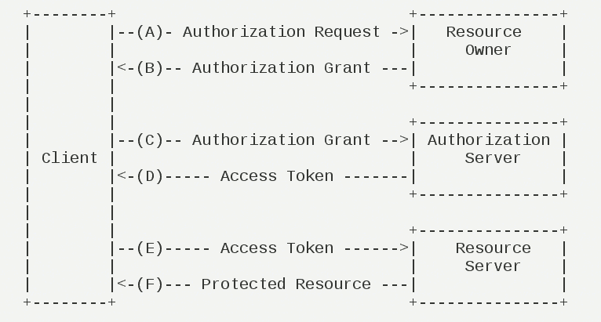
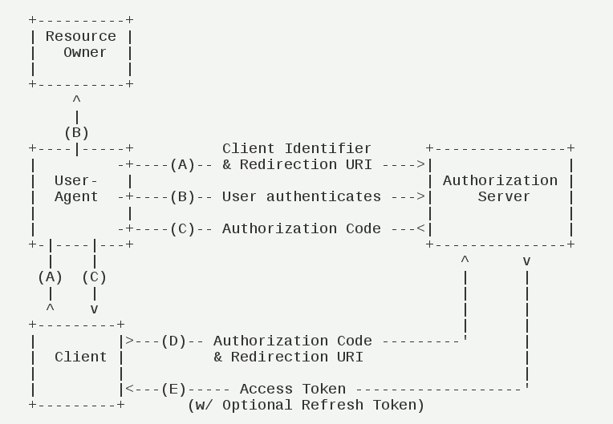

# 预习
<a href="https://oauth.net/2/">oauth2</a> 一套国际化的关于授权的标准
对于oauth2有一些专有名词，需要我们了解才能继续后面的跟进
​    
    Third-party application:第三方应用程序 比如登陆b站 可以使用扣扣登陆，扣扣就是所谓的第三方应用程序 
        分析url(这是我在b站截取的url第三方登陆来做学习) 
        https://graph.qq.com/oauth2.0/show?which=Login 登陆 
        &display=pc    登陆的设备 
        &response_type=code   授权码模式(oauth2的认证方式之一，也是公司最常用的一种方式) 
        &state=authorize       状态请求授权 
        &client_id=101135748    客户端的id(算法加密) 
        &redirect_uri=https%3A%2F%2Fpassport.bilibili.com%2Flogin%2Fsnsback%3Fsns%3Dqq%26%26state%3D788a1a900b7411eab26e3adf85295a74 回调地址 
        &scope=...  
        从上面我们可以明显看到url的规定是oauth2标准的核心流程  
    Http service：Http服务提供商 eg:Google 
    Resource Owner：资源所有者即（用户） 
    User Agent:用户代理 代指浏览器 
    Authorization Server:认证服务器(服务提供商提供专门用来处理认证的服务器) 
    Resource Server:资源服务器(服务提供商存放用户资源的服务器) 
    
    Oauth的作用就是让客户端在获取用户授权，安全的与资源服务器交互
    
    Oauth2思路:
        添加了一个中间层作为安全认证，第三方登陆，跳到第三方的服务经行登陆，用户名密码认证通过，授权获取code换取token访问redirect_uri的资源
        这中间又考虑了token换取的时间有效期，设计了refresh_token进行刷新

​    

这是我自己的见解,学习还是自己理解

**oauth2的运行流程图**

（A）用户打开客户端以后，客户端要求用户给予授权。

（B）用户同意给予客户端授权。

（C）客户端使用上一步获得的授权，向认证服务器申请令牌。

（D）认证服务器对客户端进行认证以后，确认无误，同意发放令牌。

（E）客户端使用令牌，向资源服务器申请获取资源。

（F）资源服务器确认令牌无误，同意向客户端开放资源。

**客户端的授权模式——授权码模式**

（A）用户访问客户端，后者将前者导向认证服务器。

（B）用户选择是否给予客户端授权。

（C）假设用户给予授权，认证服务器将用户导向客户端事先指定的"重定向URI"（redirection URI），同时附上一个授权码。

（D）客户端收到授权码，附上早先的"重定向URI"，向认证服务器申请令牌。这一步是在客户端的后台的服务器上完成的，对用户不可见。

（E）认证服务器核对了授权码和重定向URI，确认无误后，向客户端发送访问令牌（access token）和更新令牌（refresh token）。

<a href="http://www.ruanyifeng.com/blog/2014/05/oauth_2_0.html">参考阮老师的文档</a>

# 练习Spring Security Oauth2

第一步
    配置pom文件，集成Springboot快速开发
第二步
    配置Security
第三步
    配置授权服务器

    访问url：http://localhost:8080/oauth/authorize?response_type=code&client_id=myClient&redirect_uri=http://www.bilibili.com&scope=all
        oauth/authorize去请求授权携带url信息，源码匹配配置的客户端信息
        response_type必填
        client_id必填
        redirect_uri必填
        scope选填
        
        跳转是否授权页面，授权从后台请求oauth/token?code=？
        根据code(可以加state)换取token，一般项目都是凭借tooken访问资源服务器
        
        本次练习的redirect_uri是未受保护的，只能走一个流程体验，具体还需自己慢慢钻研
        https://www.bilibili.com/?code=J6Z6tl
    
        借鉴大神 https://www.cnblogs.com/cjsblog/p/9230990.html
        完成一次探索
